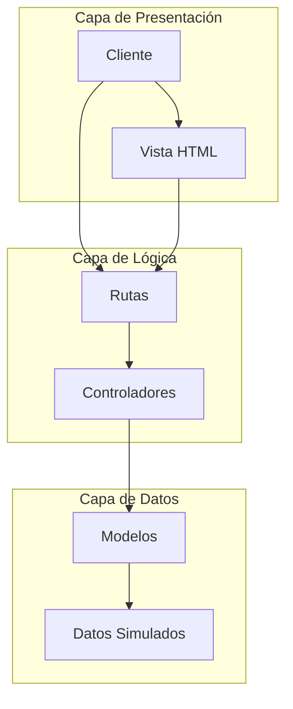
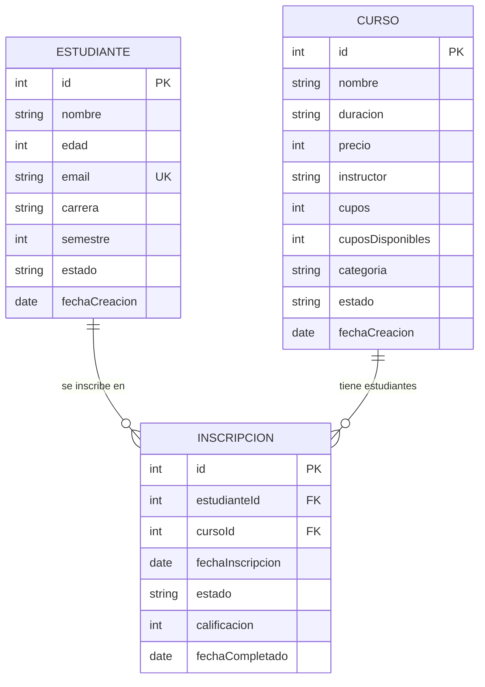

# 🎓 API de Estudiantes, Cursos e Inscripciones

> **Proyecto educativo completo** - Una API RESTful desarrollada con **Node.js** y **Express** para gestionar un sistema académico completo con estudiantes, cursos e inscripciones.

## 📋 Tabla de Contenidos

- [Descripción del Proyecto](#-descripción-del-proyecto)
- [Características Principales](#-características-principales)
- [Arquitectura del Proyecto](#-arquitectura-del-proyecto)
- [Endpoints de la API](#-endpoints-de-la-api)
- [Instalación y Configuración](#-instalación-y-configuración)
- [Uso de la API](#-uso-de-la-api)
- [Documentación Swagger](#-documentación-swagger)
- [Estructura del Proyecto](#-estructura-del-proyecto)
- [Tecnologías Utilizadas](#-tecnologías-utilizadas)
- [Despliegue](#-despliegue)
- [Contribuir](#-contribuir)

## 🎯 Descripción del Proyecto

Este proyecto es una **API completa** para gestionar un sistema académico que incluye:

- **👥 Gestión de Estudiantes**: Registro, actualización y consulta de estudiantes con información detallada
- **📚 Gestión de Cursos**: Administración de cursos con cupos, precios e instructores
- **🎫 Sistema de Inscripciones**: Matrícula de estudiantes en cursos con validaciones
- **📊 Consultas Avanzadas**: Filtros por categoría, instructor, disponibilidad, etc.

### 🎮 Propósito Educativo

Este proyecto está diseñado para **aprender y practicar**:

- Desarrollo de APIs RESTful con Node.js y Express
- Patrón de arquitectura MVC (Modelo-Vista-Controlador)
- Documentación automática con Swagger
- Validaciones y manejo de errores
- Relaciones entre entidades
- Despliegue en la nube

## ✨ Características Principales

### 🔐 Validaciones Robustas

- Validación de emails únicos
- Verificación de cupos disponibles
- Validación de rangos de edad y semestre
- Prevención de inscripciones duplicadas

### 📈 Funcionalidades Avanzadas

- **Filtrado inteligente**: Por carrera, semestre, categoría, instructor
- **Gestión de cupos**: Control automático de disponibilidad
- **Estados de inscripción**: Activa, completada, cancelada
- **Calificaciones**: Sistema de evaluación (1-5)

### 🎨 Interfaz Moderna

- Diseño retro con NES.css
- Documentación interactiva con Swagger
- Navegación intuitiva

## 🏗️ Arquitectura del Proyecto

### Patrón MVC (Modelo-Vista-Controlador)



### Estructura de Datos



## 🚀 Endpoints de la API

### 👥 Estudiantes

| Método   | Endpoint                          | Descripción                   |
| -------- | --------------------------------- | ----------------------------- |
| `GET`    | `/estudiantes`                    | Obtener todos los estudiantes |
| `GET`    | `/estudiantes/:id`                | Obtener estudiante por ID     |
| `POST`   | `/estudiantes`                    | Crear nuevo estudiante        |
| `PUT`    | `/estudiantes/:id`                | Actualizar estudiante         |
| `DELETE` | `/estudiantes/:id`                | Eliminar estudiante           |
| `GET`    | `/estudiantes/carrera/:carrera`   | Filtrar por carrera           |
| `GET`    | `/estudiantes/semestre/:semestre` | Filtrar por semestre          |

### 📚 Cursos

| Método   | Endpoint                         | Descripción              |
| -------- | -------------------------------- | ------------------------ |
| `GET`    | `/cursos`                        | Obtener todos los cursos |
| `GET`    | `/cursos/:id`                    | Obtener curso por ID     |
| `POST`   | `/cursos`                        | Crear nuevo curso        |
| `PUT`    | `/cursos/:id`                    | Actualizar curso         |
| `DELETE` | `/cursos/:id`                    | Eliminar curso           |
| `GET`    | `/cursos/categoria/:categoria`   | Filtrar por categoría    |
| `GET`    | `/cursos/instructor/:instructor` | Filtrar por instructor   |
| `GET`    | `/cursos/disponibles`            | Cursos con cupos         |
| `GET`    | `/cursos/precio/:min/:max`       | Filtrar por precio       |

### 🎫 Inscripciones

| Método   | Endpoint                                  | Descripción                     |
| -------- | ----------------------------------------- | ------------------------------- |
| `GET`    | `/inscripciones`                          | Obtener todas las inscripciones |
| `GET`    | `/inscripciones/:id`                      | Obtener inscripción por ID      |
| `POST`   | `/inscripciones`                          | Crear nueva inscripción         |
| `PUT`    | `/inscripciones/:id`                      | Actualizar inscripción          |
| `DELETE` | `/inscripciones/:id`                      | Cancelar inscripción            |
| `GET`    | `/inscripciones/estudiante/:estudianteId` | Por estudiante                  |
| `GET`    | `/inscripciones/curso/:cursoId`           | Por curso                       |

## 🛠️ Instalación y Configuración

### Prerrequisitos

- **Node.js**: v14.0 o superior
- **NPM**: v6.0 o superior
- **Git**: Para clonar el repositorio

### Pasos de Instalación

```bash
# 1. Clonar el repositorio
git clone https://github.com/brayandiazc/node_api_estudiantes.git

# 2. Entrar al directorio
cd node_api_estudiantes

# 3. Instalar dependencias
npm install

# 4. Ejecutar en modo desarrollo
npm run dev
```

### Variables de Entorno

Crea un archivo `.env` en la raíz del proyecto:

```env
PORT=3000
NODE_ENV=development
```

## 📖 Uso de la API

### Ejemplo: Crear un Estudiante

```bash
curl -X POST http://localhost:3000/estudiantes \
  -H "Content-Type: application/json" \
  -d '{
    "nombre": "Juan Pérez",
    "edad": 20,
    "email": "juan.perez@email.com",
    "carrera": "Ingeniería Informática",
    "semestre": 4
  }'
```

### Ejemplo: Crear un Curso

```bash
curl -X POST http://localhost:3000/cursos \
  -H "Content-Type: application/json" \
  -d '{
    "nombre": "Curso de Node.js",
    "duracion": "4 semanas",
    "precio": 150000,
    "instructor": "Carlos Mendoza",
    "cupos": 25,
    "categoria": "Backend"
  }'
```

### Ejemplo: Inscribir un Estudiante

```bash
curl -X POST http://localhost:3000/inscripciones \
  -H "Content-Type: application/json" \
  -d '{
    "estudianteId": 1,
    "cursoId": 1
  }'
```

## 📚 Documentación Swagger

La API incluye documentación automática con **Swagger UI**:

- **URL local**: `http://localhost:3000/api-docs`
- **URL producción**: `https://node-api-estudiantes.vercel.app/api-docs`

### Características de la Documentación

- ✅ **Interactiva**: Prueba endpoints directamente
- ✅ **Completa**: Todos los parámetros y respuestas
- ✅ **Validación**: Esquemas de datos incluidos
- ✅ **Ejemplos**: Casos de uso reales

## 📁 Estructura del Proyecto

```
node_api_estudiantes/
├── 📁 controllers/          # Lógica de negocio
│   ├── estudianteController.js
│   ├── cursoController.js
│   └── inscripcionController.js
├── 📁 models/              # Modelos de datos
│   ├── estudianteModel.js
│   ├── cursoModel.js
│   └── inscripcionModel.js
├── 📁 routes/              # Definición de rutas
│   ├── estudianteRoutes.js
│   ├── cursoRoutes.js
│   └── inscripcionRoutes.js
├── 📁 views/               # Vistas HTML
│   └── index.html
├── 📄 index.js             # Servidor principal
├── 📄 package.json         # Dependencias
├── 📄 vercel.json          # Configuración de despliegue
└── 📄 README.md            # Documentación
```

## 🛠️ Tecnologías Utilizadas

### Backend

- **Node.js**: Runtime de JavaScript
- **Express.js**: Framework web
- **Swagger**: Documentación de API
- **Nodemon**: Reinicio automático en desarrollo

### Frontend

- **NES.css**: Framework CSS retro
- **HTML5**: Estructura de la página
- **JavaScript**: Interactividad

### Herramientas

- **Git**: Control de versiones
- **Vercel**: Despliegue en la nube
- **Postman/cURL**: Pruebas de API

## 🚀 Despliegue

### Despliegue en Vercel

El proyecto está desplegado automáticamente en Vercel:

- **🌐 URL de producción**: [https://node-api-estudiantes.vercel.app/](https://node-api-estudiantes.vercel.app/)
- **📚 Documentación**: [https://node-api-estudiantes.vercel.app/api-docs](https://node-api-estudiantes.vercel.app/api-docs)

### Configuración de Despliegue

El archivo `vercel.json` contiene la configuración necesaria para el despliegue automático.

## 🎓 Casos de Uso Educativos

### Para Estudiantes de Programación

1. **Aprender APIs RESTful**: Endpoints bien estructurados
2. **Patrón MVC**: Separación clara de responsabilidades
3. **Validaciones**: Manejo robusto de datos
4. **Documentación**: Swagger como estándar de la industria
5. **Despliegue**: Proceso completo de publicación

### Para Instructores

1. **Ejemplos prácticos**: Código funcional y comentado
2. **Progresión gradual**: Desde básico hasta avanzado
3. **Buenas prácticas**: Estructura profesional
4. **Documentación completa**: Fácil de seguir

## 🤝 Contribuir

¡Las contribuciones son bienvenidas! Para contribuir:

1. **Fork** el repositorio
2. Crea una **rama** para tu feature (`git checkout -b feature/nueva-funcionalidad`)
3. **Commit** tus cambios (`git commit -am 'Agregar nueva funcionalidad'`)
4. **Push** a la rama (`git push origin feature/nueva-funcionalidad`)
5. Abre un **Pull Request**

### Ideas para Contribuir

- 🔐 Agregar autenticación JWT
- 📊 Implementar estadísticas y reportes
- 🗄️ Migrar a base de datos real (MongoDB/PostgreSQL)
- 🎨 Mejorar la interfaz de usuario
- 📱 Crear aplicación móvil
- 🧪 Agregar tests unitarios

## 📄 Licencia

Este proyecto está bajo la **Licencia MIT** - ver el archivo [LICENSE](LICENSE) para detalles.

## 👨‍💻 Autor

**Brayan Diaz C**

- 🌐 [Portfolio](https://brayandiazc.com)
- 📧 [Email](mailto:contact@brayandiazc.com)
- 🐙 [GitHub](https://github.com/brayandiazc)
- 💼 [LinkedIn](https://linkedin.com/in/brayandiazc)

---

<div align="center">

⌨️ **Desarrollado con ❤️ por Brayan Diaz C** 😊

[](https://github.com/brayandiazc)
[](https://linkedin.com/in/brayandiazc)
[](https://brayandiazc.com)

</div>
