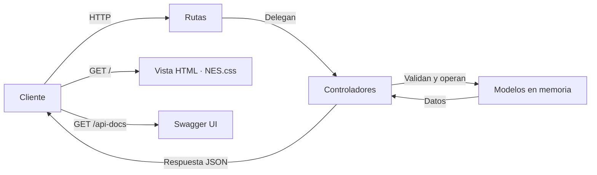

# udd-api-node

API RESTful educativa de **Estudiantes, Cursos e Inscripciones**, construida paso a paso con **Node.js** y **Express** como material de reforzamiento para estudiantes de la UDD.


## Tabla de Contenidos

- [Descripción](#descripción)
- [Características](#características)
- [Requisitos Previos](#requisitos-previos)
- [Instalación](#instalación)
- [Configuración](#configuración)
- [Uso](#uso)
- [Arquitectura](#arquitectura)
- [Stack Tecnológico](#stack-tecnológico)
- [Scripts Disponibles](#scripts-disponibles)
- [Testing](#testing)
- [Deployment](#deployment)
- [Contribución](#contribución)
- [Troubleshooting](#troubleshooting)
- [Roadmap](#roadmap)
- [Documentación](#documentación)
- [Soporte](#soporte)
- [Versionado](#versionado)
- [Autores](#autores)
- [Licencia](#licencia)
- [Apóyanos](#apóyanos)
- [Agradecimientos](#agradecimientos)

## Descripción

**udd-api-node** es una API completa para gestionar un sistema académico con estudiantes, cursos e inscripciones. Nació como proyecto **educativo** de reforzamiento para estudiantes de la Universidad del Desarrollo (UDD): una guía paso a paso para aprender a construir una API RESTful con Node.js y Express aplicando el patrón **MVC (Modelo-Vista-Controlador)**.

Cubre, con ejemplos funcionales y comentados:

- Desarrollo de APIs RESTful con Node.js y Express.
- Patrón de arquitectura MVC.
- Documentación automática con Swagger (OpenAPI 3.0).
- Validaciones y manejo de errores.
- Relaciones entre entidades.
- Despliegue en la nube (Vercel).

> **Nota didáctica:** los datos son **simulados en memoria** (arrays en `models/*.js`). No hay base de datos real, por lo que los cambios no persisten al reiniciar el servidor. Esto mantiene el foco en la mecánica de la API.

### Flujo de Funcionamiento


```mermaid
graph LR
    A[Cliente] -->|HTTP| B[Rutas]
    B -->|Delegan| C[Controladores]
    C -->|Validan y operan| D[Modelos en memoria]
    D -->|Datos| C
    C -->|Respuesta JSON| A
    A -->|GET /| E[Vista HTML · NES.css]
    A -->|GET /api-docs| F[Swagger UI]
```

## Características

- ✅ CRUD completo de estudiantes, cursos e inscripciones.
- ✅ Filtros avanzados: por carrera, semestre, categoría, instructor, disponibilidad y rango de precio.
- ✅ Validaciones de negocio: email único, control de cupos, rangos de edad (16–100) y semestre (1–12), prevención de inscripciones duplicadas.
- ✅ Documentación interactiva con Swagger UI en `/api-docs`.
- ✅ Vista de inicio con estilo retro (NES.css).
- 🚧 Autenticación (JWT) — planificada.
- 📋 Migración a base de datos real y suite de tests — planificadas.

## Requisitos Previos

Antes de comenzar, asegúrate de tener instalado:

- **Node.js**: v14 o superior (el CI usa v20).
- **npm**: v6 o superior.
- **Git**: para clonar el repositorio.

## Instalación

### 1. Clonar el repositorio

```bash
git clone https://github.com/brayandiazc/udd-api-node.git
cd udd-api-node
```

### 2. Instalar dependencias

```bash
npm install
```

### 3. Configurar variables de entorno

```bash
cp .env.example .env
# Edita .env si necesitas cambiar el puerto
```

## Configuración

Las variables de entorno se documentan en [`.env.example`](.env.example). Cópialo a `.env` y ajusta los valores para tu entorno.

| Variable   | Descripción                          | Valor por defecto |
| ---------- | ------------------------------------ | ----------------- |
| `PORT`     | Puerto del servidor HTTP             | `3000`            |
| `NODE_ENV` | Entorno de ejecución                 | `development`     |

> Nunca subas tu archivo `.env` con valores reales al repositorio. Ver [SECURITY.md](SECURITY.md) y [`docs/conventions/secrets.md`](docs/conventions/secrets.md).

## Uso

### Desarrollo local

```bash
npm run dev
# La aplicación queda disponible en http://localhost:3000
# Documentación Swagger en http://localhost:3000/api-docs
```

### Ejemplos de uso

```bash
# Listar todos los estudiantes
curl http://localhost:3000/estudiantes

# Crear un estudiante
curl -X POST http://localhost:3000/estudiantes \
  -H "Content-Type: application/json" \
  -d '{"nombre":"Juan Pérez","edad":20,"email":"juan.perez@email.com","carrera":"Ingeniería Informática","semestre":4}'

# Inscribir un estudiante en un curso
curl -X POST http://localhost:3000/inscripciones \
  -H "Content-Type: application/json" \
  -d '{"estudianteId":1,"cursoId":1}'
```

Para el contrato completo de la API, ver [`docs/architecture/api.md`](docs/architecture/api.md).

## Arquitectura

El proyecto sigue el patrón **MVC** en tres capas: las **rutas** reciben la petición y la delegan a los **controladores**, que aplican la lógica de negocio sobre los **modelos** (datos simulados en memoria). Detalle completo en [`docs/architecture/architecture.md`](docs/architecture/architecture.md).

## Stack Tecnológico

- **Node.js** + **Express** — runtime y framework web.
- **swagger-jsdoc** + **swagger-ui-express** — documentación OpenAPI.
- **dotenv** — configuración por variables de entorno.
- **nodemon** — recarga automática en desarrollo.
- **NES.css** — estilos retro de la vista de inicio.

Inventario completo (con versiones y justificación) en [`docs/architecture/stack.md`](docs/architecture/stack.md).

## Scripts Disponibles

```bash
npm start    # Inicia el servidor (node index.js)
npm run dev  # Inicia en modo desarrollo con recarga automática (nodemon)
npm test     # Ejecuta los tests (placeholder: aún no hay suite de tests)
```

## Testing

Actualmente el proyecto **no incluye tests** — `npm test` es un placeholder. Se recomienda adoptar **Jest** + **Supertest** para las pruebas unitarias y de integración. Convenciones en [`docs/conventions/testing.md`](docs/conventions/testing.md).

```bash
npm test
```

## Deployment

El proyecto se despliega en **Vercel** de forma automática desde la rama `main`.

| Ambiente   | URL                                          | Rama   | Deploy     |
| ---------- | -------------------------------------------- | ------ | ---------- |
| Producción | https://node-api-estudiantes.vercel.app      | `main` | Automático |

La configuración vive en [`vercel.json`](vercel.json). Procedimiento detallado en [`docs/conventions/deploy.md`](docs/conventions/deploy.md).

## Contribución

Lee la [Guía de Contribución](CONTRIBUTING.md) para conocer el flujo de trabajo (Git Flow), los estándares de código, el formato de commits (Conventional Commits) y el proceso de Pull Requests.

## Troubleshooting

#### Error: "EADDRINUSE: address already in use :::3000"

El puerto 3000 ya está ocupado. Cambia el puerto o libera el proceso:

```bash
PORT=3001 npm run dev
# o identifica el proceso que usa el puerto 3000
lsof -i :3000
```

#### Los datos vuelven a su estado inicial al reiniciar

Es el comportamiento esperado: los datos son simulados en memoria y no se persisten. Para persistencia real habría que integrar una base de datos (ver [roadmap](docs/product/roadmap.md)).

### Obtener ayuda

1. Revisa la [documentación](docs/README.md).
2. Busca en los [issues existentes](https://github.com/brayandiazc/udd-api-node/issues).
3. Abre un nuevo issue o contacta a <contact@brayandiazc.com>.

## Roadmap

Visión y próximos pasos en [`docs/product/roadmap.md`](docs/product/roadmap.md): autenticación JWT, migración a base de datos real, suite de tests, estadísticas y mejoras de UI.

## Documentación

Toda la documentación vive en [`docs/`](docs/README.md):

| Documento                                                                | Responde a                           |
| ------------------------------------------------------------------------ | ------------------------------------ |
| [`docs/architecture/architecture.md`](docs/architecture/architecture.md) | ¿Cómo está construido?               |
| [`docs/architecture/stack.md`](docs/architecture/stack.md)               | ¿Con qué tecnologías?                |
| [`docs/architecture/database.md`](docs/architecture/database.md)         | ¿Qué entidades y relaciones?         |
| [`docs/architecture/api.md`](docs/architecture/api.md)                   | ¿Qué endpoints expone?               |
| [`docs/architecture/auth.md`](docs/architecture/auth.md)                 | ¿Cómo se autentica y autoriza?       |
| [`docs/architecture/design.md`](docs/architecture/design.md)             | ¿Cómo se diseña y por qué?           |
| [`docs/product/business-model.md`](docs/product/business-model.md)       | ¿Por qué existe / cómo aporta valor? |
| [`docs/product/roadmap.md`](docs/product/roadmap.md)                     | ¿Hacia dónde va?                     |
| [`docs/decisions/`](docs/decisions/README.md)                            | ¿Por qué tomamos cada decisión?      |
| [`docs/conventions/`](docs/conventions/README.md)                        | ¿Cómo trabajamos en este repo?       |

## Soporte

¿Problemas o sugerencias? Abre un issue en [el repositorio](https://github.com/brayandiazc/udd-api-node/issues) o escribe a <contact@brayandiazc.com>.

## Versionado

Usamos [Git](https://git-scm.com) para el control de versiones y seguimos [Semantic Versioning](https://semver.org/). Consulta las [etiquetas](https://github.com/brayandiazc/udd-api-node/tags) para ver las versiones disponibles y el [CHANGELOG](CHANGELOG.md).

## Autores

- **Brayan Diaz C** — _Trabajo inicial_ — [@brayandiazc](https://github.com/brayandiazc)

Consulta también la lista de [contribuidores](https://github.com/brayandiazc/udd-api-node/contributors).

## Licencia

Este proyecto está bajo la licencia [MIT](LICENSE).

## Apóyanos

Si este proyecto te resulta útil y quieres apoyar su desarrollo:

- [GitHub Sponsors](https://github.com/sponsors/brayandiazc)
- [Ko-fi](https://ko-fi.com/brayandiazc)

## Agradecimientos

Gracias a quienes contribuyen a este proyecto. Si encuentras valor en él, puedes:

- Compartir el proyecto 📤
- Invitar un café ☕
- Abrir un issue o PR 🙌
- Dejar tu agradecimiento con un comentario 💬

---

⌨️ con ❤️ por [@brayandiazc](https://github.com/brayandiazc)
