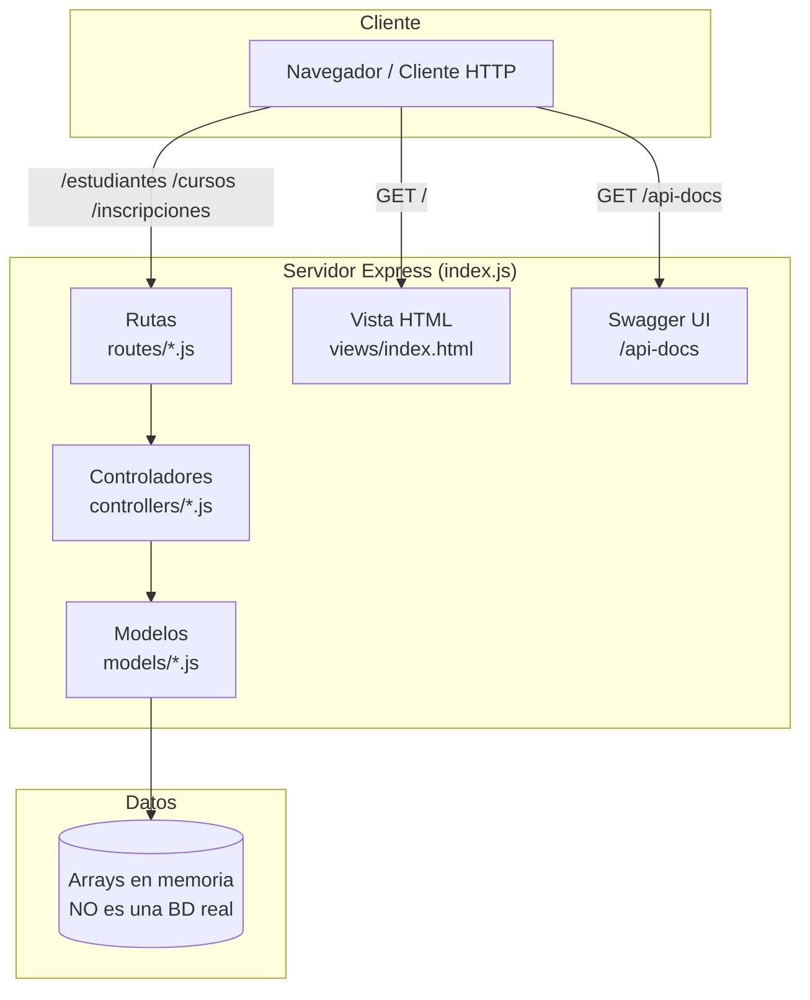
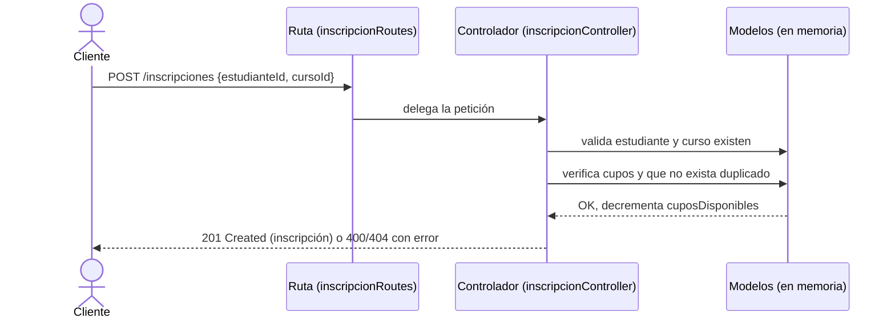

# udd-api-node — Arquitectura

> Vista de alto nivel de cómo está construido el sistema y cómo se reparten las
> responsabilidades. Para el stack real (versiones, librerías) ver
> [`stack.md`](stack.md). Para el negocio ver
> [`../product/business-model.md`](../product/business-model.md).
>
> **Última actualización**: 2026-07-02

Este proyecto es una **API RESTful educativa** construida con Node.js y Express
siguiendo el patrón **MVC** (Modelo-Vista-Controlador). Gestiona tres recursos:
estudiantes, cursos e inscripciones. **No usa una base de datos real**: los datos
están **simulados en memoria** como arrays JavaScript en `models/*.js`, por lo que
los cambios no persisten al reiniciar el servidor.

## Diagrama

## Componentes

| Componente     | Responsabilidad                                                                 | Tecnología |
| -------------- | ------------------------------------------------------------------------------- | ---------- |
| Rutas (`routes/`) | Definen los endpoints HTTP y contienen las anotaciones `@swagger`. Delegan en los controladores. Archivos: `estudianteRoutes`, `cursoRoutes`, `inscripcionRoutes`. | Express Router |
| Controladores (`controllers/`) | Lógica de negocio y validaciones (email único, edad, cupos, duplicados). Reciben la request, operan sobre los modelos y arman la respuesta JSON. | JavaScript / Express |
| Modelos (`models/`) | "Persistencia" simulada: arrays en memoria con los datos y las operaciones sobre ellos. No hay ORM ni BD real. | Arrays JavaScript |
| Vista (`views/index.html`) | Página estática de bienvenida con estilo retro NES.css, servida en `/`. | HTML + NES.css |
| Documentación (`/api-docs`) | UI interactiva de la API generada desde las anotaciones OpenAPI 3.0. | swagger-jsdoc + swagger-ui-express |
| Servidor (`index.js`) | Punto de entrada: configura Express, monta las rutas, la vista y Swagger, y escucha en el puerto `PORT` (3000 por defecto). | Node.js + Express |

## Decisiones clave

| Decisión                                   | Razón                                                                 |
| ------------------------------------------ | --------------------------------------------------------------------- |
| Patrón MVC con carpetas separadas          | Enseñar separación de responsabilidades de forma clara y estándar.    |
| Datos simulados en memoria (sin BD real)   | Eliminar la fricción de configurar una base de datos para centrarse en la API y el MVC. |
| Documentación con Swagger junto al código  | Mantener la doc siempre sincronizada con las rutas y ofrecer un UI interactivo. |
| Despliegue en Vercel desde `main`          | Deploy automático y sencillo para un proyecto de este tamaño.         |
| Sin autenticación (API pública)            | Simplicidad didáctica; la seguridad se documenta como trabajo futuro (ver [`auth.md`](auth.md)). |

> El detalle y las alternativas de cada decisión relevante se registran como
> ADRs en [`../decisions/`](../decisions/README.md).

## Reglas no negociables

- El flujo siempre respeta las capas: **ruta → controlador → modelo**. Las rutas no acceden directamente a los datos.
- Las validaciones de negocio viven en los controladores (email único, edad 16–100, semestre 1–12, control de cupos, inscripciones no duplicadas, calificación 1–5).
- El email de cada estudiante debe ser único.
- No se puede inscribir a un curso sin `cuposDisponibles`; al inscribir se decrementa el cupo.
- Al ser datos en memoria, **ningún cambio persiste tras reiniciar**; esto debe quedar siempre explícito para quien aprende.

## Flujos principales

Ejemplo: creación de una inscripción (`POST /inscripciones`).

## Referencias

- [`stack.md`](stack.md) — stack tecnológico y versiones.
- [`database.md`](database.md) — modelo de datos.
- [`auth.md`](auth.md) — autenticación y autorización.
- [`api.md`](api.md) — contrato de API.
- [`../conventions/`](../conventions/README.md) — convenciones de trabajo.
