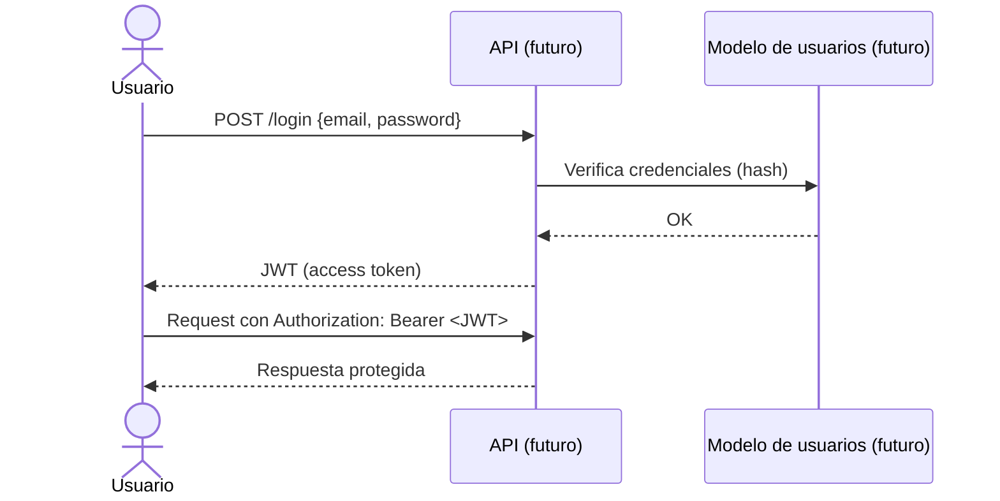

# Autenticación y Autorización

> Cómo se autentican y autorizan los usuarios en **udd-api-node**.
> Para las reglas transversales ver [`../conventions/authentication.md`](../conventions/authentication.md).
>
> **Última actualización**: 2026-07-02

## Visión general

> ⚠️ **Estado actual: la API NO tiene autenticación ni autorización.** Todos los
> endpoints son **públicos** y cualquiera puede leer, crear, editar o eliminar
> estudiantes, cursos e inscripciones sin credenciales. Esto es intencional para
> mantener el proyecto simple con fines didácticos. La sección de "trabajo futuro"
> describe cómo se añadiría; **no describe algo ya implementado**.

- **Método de autenticación**: ninguno (API abierta).
- **Almacenamiento de credenciales**: no aplica; no hay usuarios ni credenciales.
- **Hashing de contraseñas**: no aplica; no se almacenan contraseñas.

## Modelo de identidad

| Concepto       | Descripción                                                       |
| -------------- | ----------------------------------------------------------------- |
| Usuario        | No existe una entidad "usuario autenticable". El recurso `Estudiante` es un dato de negocio, **no** una identidad con la que iniciar sesión. |
| Sesión / Token | No aplica; no hay sesiones ni tokens.                             |
| Roles          | No aplica; no hay roles ni permisos.                              |

## Flujo de registro / login

No hay flujo de registro ni de login en el estado actual. El siguiente diagrama
ilustra cómo **sería** un login con JWT si se implementara en el futuro:

## Gestión de sesiones / tokens

- **No aplica actualmente.** En un diseño futuro con JWT se definiría: expiración (TTL) del access token, refresh tokens para renovación y una estrategia de revocación.

## Autorización

- **No aplica actualmente**: no hay control de acceso; todas las operaciones están abiertas.
- En un diseño futuro se podría usar RBAC (control por roles), por ejemplo roles como los siguientes:

| Rol (propuesto)  | Permisos (propuestos)                                     |
| ---------------- | -------------------------------------------------------- |
| administrador    | Crear/editar/eliminar estudiantes, cursos e inscripciones. |
| lector           | Solo consultar (GET) los recursos.                        |

> Esta tabla es una **propuesta de roadmap**, no refleja el comportamiento actual.

## Proveedores externos (OAuth / SSO)

- **No aplica**: no hay integración con proveedores OAuth ni SSO.

## Recuperación de cuenta

- **No aplica**: al no existir cuentas ni credenciales, no hay flujos de reset de contraseña, cambio de email ni verificación.

## Trabajo futuro (roadmap)

La autenticación es un candidato de roadmap. Una implementación típica añadiría:

1. Una entidad de usuarios con contraseñas hasheadas (p. ej. bcrypt o argon2).
2. Endpoints de registro y login que emitan **JWT**.
3. Un middleware de Express que valide el header `Authorization: Bearer <token>` en las rutas que se quieran proteger.
4. Autorización por roles (RBAC) para distinguir quién puede escribir y quién solo leer.
5. Gestión del secreto de firma y del TTL del token mediante variables de entorno.

## Consideraciones de seguridad

Al ser una API pública sin autenticación, **no debe usarse con datos reales o
sensibles**. Es un entorno de aprendizaje. Ver [SECURITY.md](../../SECURITY.md)
para la política completa.
