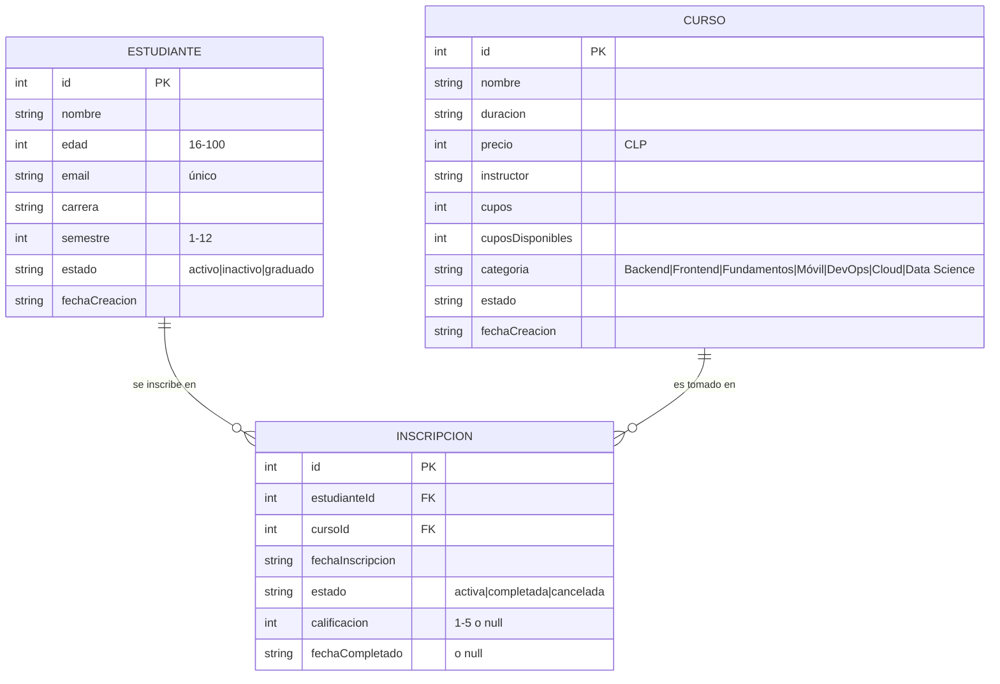

# Modelo de Datos

> Esquema, entidades y relaciones de **udd-api-node**.
> Para las **reglas y estándares** de modelado (nomenclatura, tipos, índices)
> ver [`../conventions/database.md`](../conventions/database.md).
>
> **Última actualización**: 2026-07-02

> ⚠️ **Importante**: este proyecto **no tiene una base de datos real**. La
> persistencia está **simulada en memoria** mediante arrays JavaScript en
> `models/*.js` (`estudianteModel.js`, `cursoModel.js`, `inscripcionModel.js`).
> Los datos se cargan con un conjunto semilla al iniciar y **cualquier cambio se
> pierde al reiniciar el servidor**. Aun así, modelamos las entidades como si
> fueran tablas para enseñar el diseño relacional.

## Diagrama Entidad-Relación

## Entidades principales

### Estudiante

- **Propósito**: representa a un/a estudiante de la UDD. Hay 22 registros semilla.
- **Campos clave**:
  - `id` (int, PK) — identificador único.
  - `nombre` (string) — nombre completo.
  - `edad` (int) — entre 16 y 100.
  - `email` (string, único) — no puede repetirse.
  - `carrera` (string) — carrera que cursa.
  - `semestre` (int) — entre 1 y 12.
  - `estado` (string) — `activo` | `inactivo` | `graduado`.
  - `fechaCreacion` (string, fecha) — fecha de alta.
- **Relaciones**: un estudiante tiene muchas inscripciones (1—N con `Inscripcion`).

### Curso

- **Propósito**: representa un curso ofertado. Hay 22 registros semilla.
- **Campos clave**:
  - `id` (int, PK) — identificador único.
  - `nombre` (string) — nombre del curso.
  - `duracion` (string) — p. ej. "4 semanas".
  - `precio` (int) — valor en pesos chilenos (CLP).
  - `instructor` (string) — quién lo dicta.
  - `cupos` (int) — capacidad total.
  - `cuposDisponibles` (int) — plazas libres; se decrementa al inscribir.
  - `categoria` (string) — `Backend` | `Frontend` | `Fundamentos` | `Móvil` | `DevOps` | `Cloud` | `Data Science`.
  - `estado` (string) — estado del curso.
  - `fechaCreacion` (string, fecha) — fecha de alta.
- **Relaciones**: un curso tiene muchas inscripciones (1—N con `Inscripcion`).

### Inscripcion

- **Propósito**: tabla puente que vincula a un estudiante con un curso.
- **Campos clave**:
  - `id` (int, PK) — identificador único.
  - `estudianteId` (int, FK → Estudiante) — estudiante inscrito.
  - `cursoId` (int, FK → Curso) — curso al que se inscribe.
  - `fechaInscripcion` (string, fecha) — cuándo se inscribió.
  - `estado` (string) — `activa` | `completada` | `cancelada`.
  - `calificacion` (int o null) — entre 1 y 5; `null` hasta completar.
  - `fechaCompletado` (string o null) — fecha de término; `null` si aún no se completa.
- **Relaciones**: pertenece a un estudiante y a un curso (N—1 con cada uno).

## Relaciones y cardinalidad

| Relación                     | Cardinalidad | Notas                                                        |
| ---------------------------- | ------------ | ------------------------------------------------------------ |
| Estudiante → Inscripcion     | 1:N          | Un estudiante puede tener varias inscripciones.              |
| Curso → Inscripcion          | 1:N          | Un curso puede tener varias inscripciones.                   |
| Estudiante ↔ Curso           | N:M          | Relación muchos-a-muchos resuelta mediante `Inscripcion`.    |

## Índices y restricciones

Al ser datos en memoria, estas restricciones **se aplican por código en los
controladores**, no por un motor de base de datos:

- `email` del estudiante debe ser **único** (se valida antes de crear).
- `edad` del estudiante entre 16 y 100; `semestre` entre 1 y 12.
- No se permite inscribir si el curso no tiene `cuposDisponibles`; al inscribir se decrementa.
- No se permiten **inscripciones duplicadas** (mismo `estudianteId` + `cursoId`).
- `calificacion` de una inscripción entre 1 y 5.

## Migraciones y versionado del esquema

- **No aplica**: no hay base de datos ni sistema de migraciones. El "esquema" es
  la forma de los objetos en los arrays de `models/*.js`. Cambiar la estructura
  significa editar esos archivos directamente.

## Datos semilla (seeds)

- **No hay comando de seed**: los datos base están escritos directamente en los
  arrays de `models/*.js` y se cargan en memoria al iniciar el servidor
  (`npm start`). Incluyen 22 estudiantes, 22 cursos y sus inscripciones de ejemplo.

## Qué implicaría migrar a una base de datos real

Si en el futuro se quisiera persistencia real (candidato de roadmap):

1. Elegir un motor (p. ej. PostgreSQL relacional o MongoDB documental).
2. Incorporar un ORM/ODM (p. ej. Prisma, Sequelize o Mongoose) como capa de datos.
3. Traducir estas entidades a tablas/colecciones con sus claves foráneas e índices (unicidad de `email`, FKs de `Inscripcion`).
4. Sustituir el acceso a los arrays en `models/*.js` por consultas del ORM, manteniendo la misma interfaz para no tocar los controladores.
5. Añadir migraciones versionadas y un script de seed real.
6. Configurar la cadena de conexión mediante variables de entorno (`.env`).
